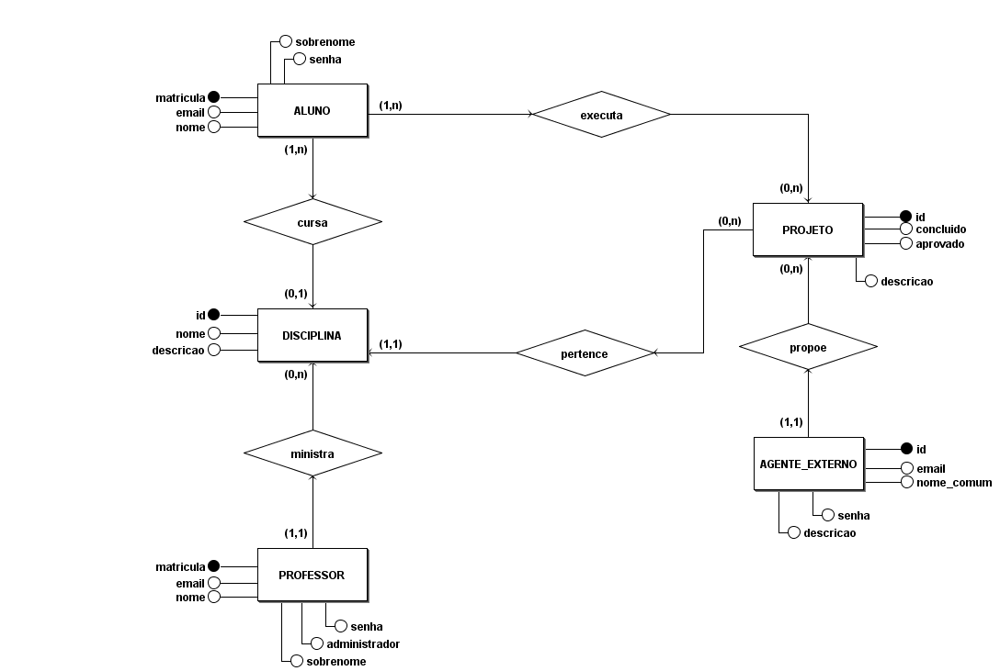
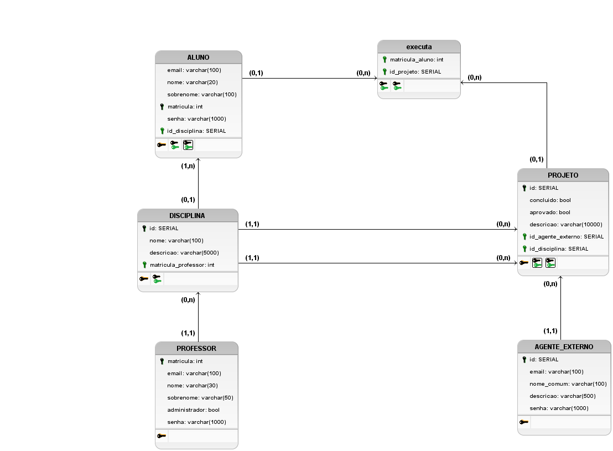

# Banco de Dados
| Data | Versão | Autores | Descrição |
| ---- | ------ | ------- | --------- |
| 11/09/2021 | 1.0 | Gabriel Tiveron | Criação da documentação do Banco de dados |

## Breve descrição do Produto

PUMA é um software de aproximação entre agentes externos, que propõem problemas e buscam alguém para solucioná-lo, e alunos, que necessitam passar pela experiência de executar um projeto real dentro de diversas disciplinas do curso de Engenharia de Produção. Dessa forma, é necessário que cada turma, supervisionada pelo seu professor, possua alunos separados em equipes para a execução de projetos propostos por agentes externos.

## Modelo Entidade-Relacionamento

### Entidades

- ALUNO
  - *matricula*
  - email
  - nome
  - sobrenome
  - senha
- DISCIPLINA
  - *id*
  - nome
  - descricao
- PROFESSOR
  - *matricula*
  - email
  - nome
  - sobrenome
  - administrador
  - senha
- PROJETO
  - *id*
  - concluido
  - aprovado
  - descricao
- AGENTE_EXTERNO
  - *id*
  - email
  - nome_comum
  - senha
  - descricao

### Relacionamentos

- PROFESSOR - *ministra* - DISCIPLINA
  - Um PROFESSOR ministra de 0 a N DISCIPLINA e uma DISCIPLINA é ministrada por apenas 1 professor.

- ALUNO - *cursa* - DISCIPLINA
  - Um ALUNO cursa de 0 a 1 DISCIPLINA e uma DISCIPLINA é cursada por N alunos.

- ALUNO - *executa* - PROJETO
  - Um ALUNO executa 0 a N PROJETO e um projeto é executado por 1 a N ALUNO.

- PROJETO - *pertence* - DISCIPLINA
  - Um PROJETO  pertence a 1 DISCIPLINA e uma DISCIPLINA possui 1 a N PROJETO.

- AGENTE_EXTERNO - *propoe* - PROJETO
  - Um AGENTE_EXTERNO propoe 1 a N PROJETO e um PROJETO é proposto por apenas 1 AGENTE_EXTERNO

## Diagrama Entidade Relacionamento

## Diagrama Lógico

## Referência

[brModelo](http://www.sis4.com/brModelo/)
