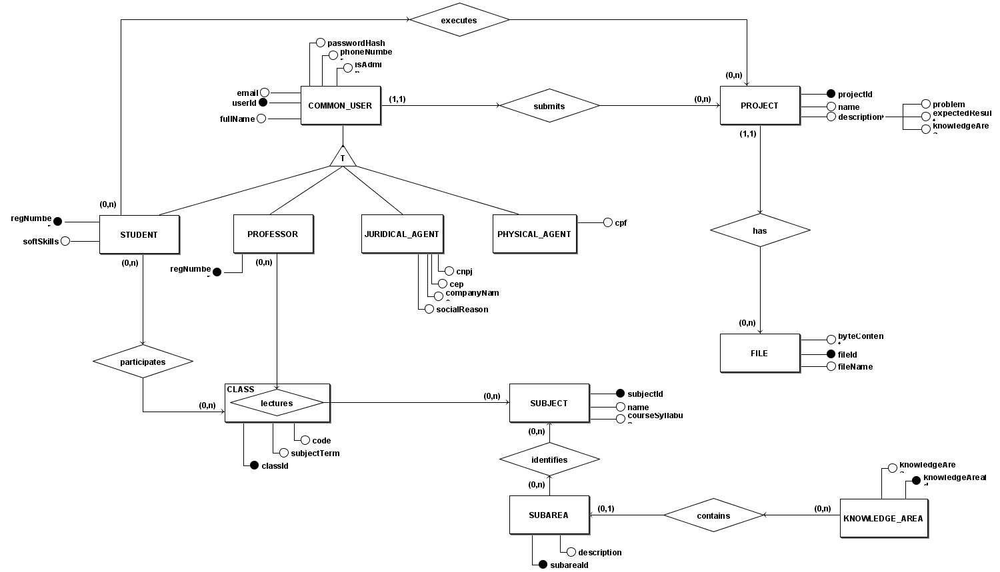
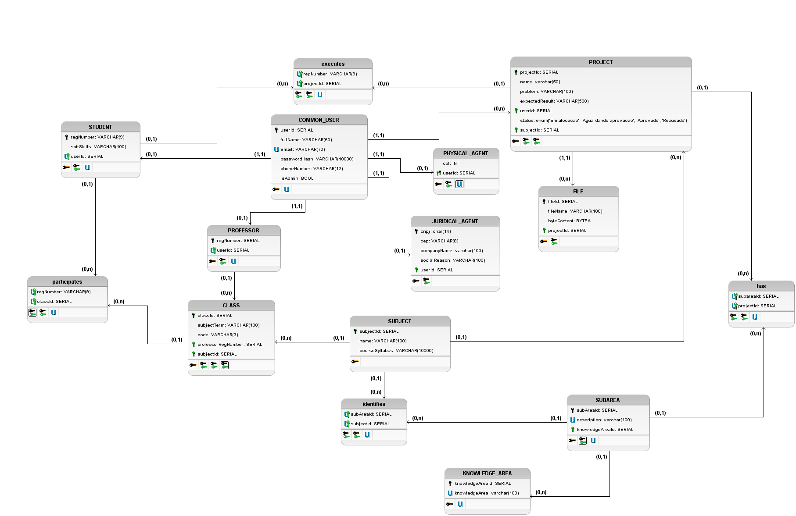

# Banco de Dados
| Data | Versão | Autores | Descrição |
| ---- | ------ | ------- | --------- |
| 11/09/2021 | 1.0 | Gabriel Tiveron | Criação da documentação do Banco de dados |
| 23/09/2021 | 1.1 | Gabriel Tiveron, João Pedro, Samuel Pereira | Atualização do ME-R |

## Breve descrição do Produto

PUMA é um software de aproximação entre agentes externos, que propõem problemas e buscam alguém para solucioná-lo, e alunos, que necessitam passar pela experiência de executar um projeto real dentro de diversas disciplinas do curso de Engenharia de Produção. Dessa forma, é necessário que cada turma, supervisionada pelo seu professor, possua alunos separados em equipes para a execução de projetos propostos por agentes externos.

## Modelo Entidade-Relacionamento

### ENTIDADES

&emsp;&emsp;USER  
&emsp;&emsp;&emsp;&emsp;STUDENT  
&emsp;&emsp;&emsp;&emsp;PROFESSOR  
&emsp;&emsp;&emsp;&emsp;JURIDICAL_AGENT  
&emsp;&emsp;PHYSICAL_AGENT  
&emsp;&emsp;PROJECT  
&emsp;&emsp;SUBJECT  
&emsp;&emsp;CLASS  
&emsp;&emsp;FILE  
&emsp;&emsp;SUBAREA  

### ATRIBUTOS

&emsp;&emsp;USER (**userId**, fullName, email, passwordHash, phoneNumber, isAdmin)  
&emsp;&emsp;STUDENT (regNumber, **userId**, softSkills)  
&emsp;&emsp;PROFESSOR (regNumber, **userId**)  
&emsp;&emsp;JURIDICAL_AGENT (**userId**, cnpj, cep, companyName, socialReason)  
&emsp;&emsp;PHYSICAL_AGENT (**userId**, cpf)  
&emsp;&emsp;PROJECT (**projectId**, name, description (problem, expectedResult, knowledgeArea))  
&emsp;&emsp;SUBAREA (**subAreaId**, description)  
&emsp;&emsp;SUBJECT (**subjectId**, name, courseSyllabus)  
&emsp;&emsp;CLASS (**classId**, subjectTerm, code)  
&emsp;&emsp;FILE (**fileId**, projectId, filename, byteContent)  

### RELACIONAMENTOS

&emsp;&emsp;USER - submits - PROJECT  
&emsp;&emsp;&emsp;&emsp;Um usuário submete um ou mais projetos e um projeto é proposto por apenas um usuário.  
&emsp;&emsp;&emsp;&emsp;Cardinalidade: 1:N.  
 
&emsp;&emsp;STUDENT - participates - CLASS  
&emsp;&emsp;&emsp;&emsp;Um estudante participa de uma ou mais turmas e uma turma é participada por um ou mais alunos.  
&emsp;&emsp;&emsp;&emsp;Cardinalidade: N:M  
 
&emsp;&emsp;STUDENT - executes - PROJECT  
&emsp;&emsp;&emsp;&emsp;Um estudante executa um ou mais projetos e um projeto é executado por um ou mais alunos.  
&emsp;&emsp;&emsp;&emsp;Cardinalidade: N:M  
 
&emsp;&emsp;PROFESSOR - lectures - SUBJECT  
&emsp;&emsp;&emsp;&emsp;Um professor pode lecionar várias disciplinas e uma disciplina pode ser lecionada por vários professores.  
&emsp;&emsp;&emsp;&emsp;Cardinalidade: N:M.  
 
&emsp;&emsp;PROJECT - has - FILE  
&emsp;&emsp;&emsp;&emsp;Um projeto pode possuir vários arquivos e um arquivo pertence a somente um projeto.  
&emsp;&emsp;&emsp;&emsp;Cardinalidade: 1:N.  
 
&emsp;&emsp;SUBAREA - identifies - SUBJECT  
&emsp;&emsp;&emsp;&emsp;Uma sub-área pode identificar várias disciplinas e uma disciplina é identificada por uma ou mais sub-áreas.  
&emsp;&emsp;&emsp;&emsp;Cardinalidade: N:M.  

## Diagrama Entidade Relacionamento

## Diagrama Lógico

## Referência

[brModelo](http://www.sis4.com/brModelo/)
