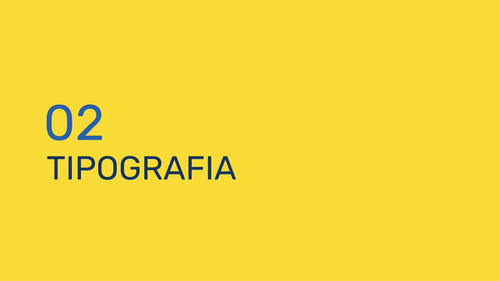
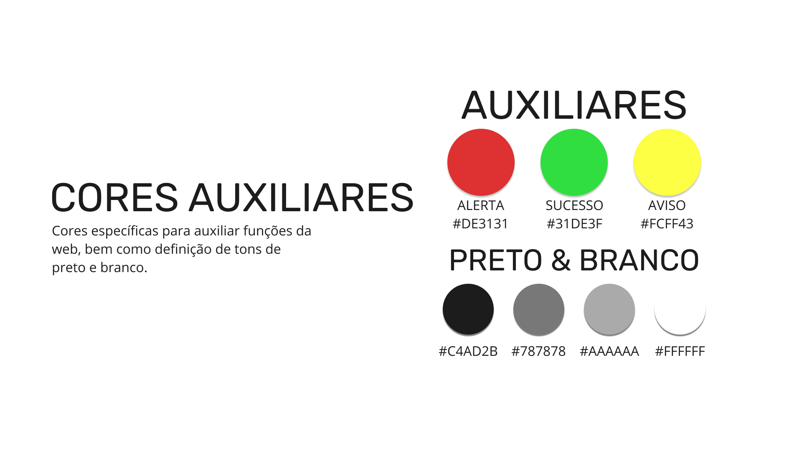

# Documento de Identidade Visual
| Data | Versão | Autores | Descrição |
|--|--|--|--|
| 14/09/2021 | 0.1 | Samuel Pereira | Criação do documento na wiki |
| 15/09/2021 | 0.2 | Samuel Pereira | Atualização de tons de escuro |
| 15/09/2021 | 1.0 | Samuel Pereira | Consertando link e atualizando PDF |

## Guia de Identidade Visual

Disponível como <a href="https://github.com/fga-eps-mds/2021-1-PUMA/raw/main/docs/assets/guia-de-estilo/guia-de-identidade-visual.pdf">PDF</a>.

## Referências
HU, Snow. 10 Best UI Style Guide Examples & Templates for Better UX. Mockplus. Disponível em: https://www.mockplus.com/blog/post/ui-style-guide. Acesso em: 14 set. 2021.