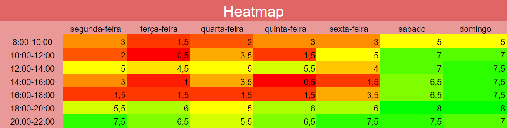

# Plano de Comunicação
| Data | Versão | Autores | Descrição |
|--|--|--|--|
| 10/09/2021 | 1.0 | Samuel Pereira | Criação do documento |

## Ferramentas
- Telegram: Utilizado para a comunicação entre as equipes de MDS e EPS.
- Discord: Utilizado para a comunicação entre as duas equipes e os stakeholders, como também para reuniões de sprint review e planning.
- Jitsi: Utilizado para a realização de reuniões com stakeholders e das etapas do Lean Inception.
- Google Drive: Utilizado para o armazenamento e compartilhamento de documentos diversos entre os membros da equipe de EPS e MDS.
- Google Agenda: Utilizado para marcação e lembretes de reuniões.
- Cuckoo: Utilizado para realização de time-box durante reuniões.
- Zenhub: Utilizado como o Kanban da equipe tanto de MDS como de EPS.

## Agenda de Trabalho
Cada integrante de ambas as equipes preencheu planilhas de disponibilidades pessoais, categorizando horários como: possuo disponibilidade, possuo alguma disponibilidade e não possuo disponibilidade. A partir dessas planilhas, foi criado um heatmap para melhor visualização da disponibilidade dos horários.

Uma reunião foi então realizada com os membros de EPS e MDS, ficando definido dailies às 13h durante dias da semana e sábado às 19h como reunião de sprint review e planning.  
Todavia, devido à disponibilidade dos stakeholders, houveram mudanças nesses horários. Dessa forma, os horários de reuniões e dailies ficaram definidos como:
- Sprint review e planning na sexta-feira às 18h;
- Reunião com stakeholders e lean inception na quarta-feira às 18h;
- Dailies durante dias da semana às 13h.