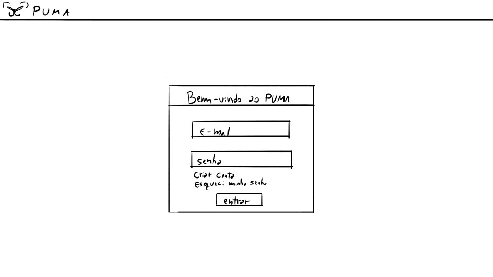
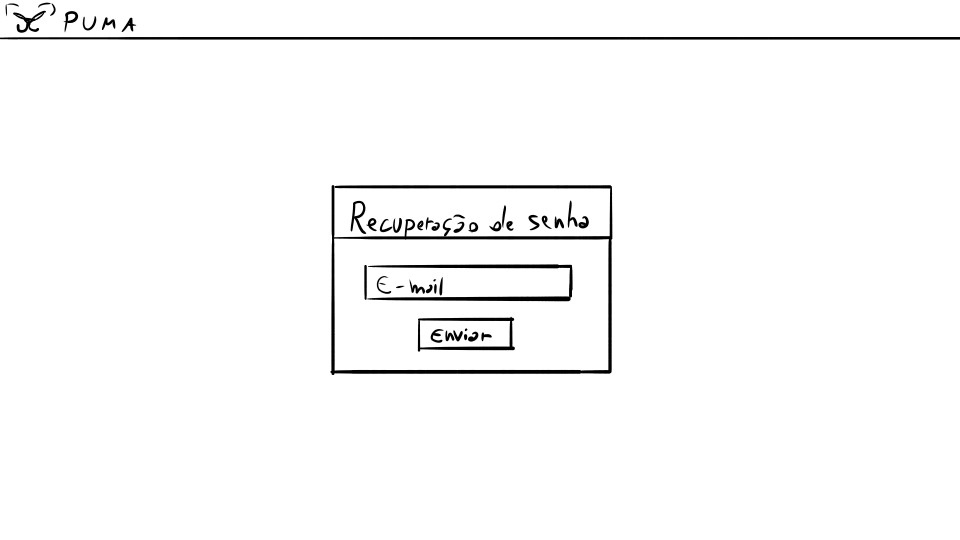
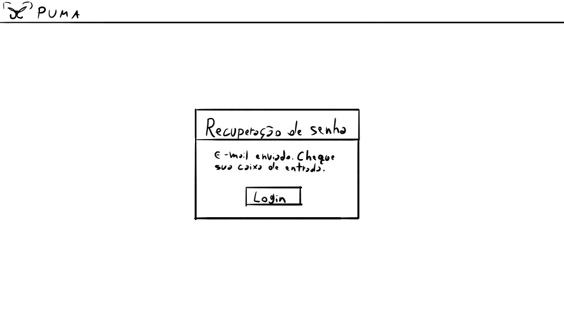
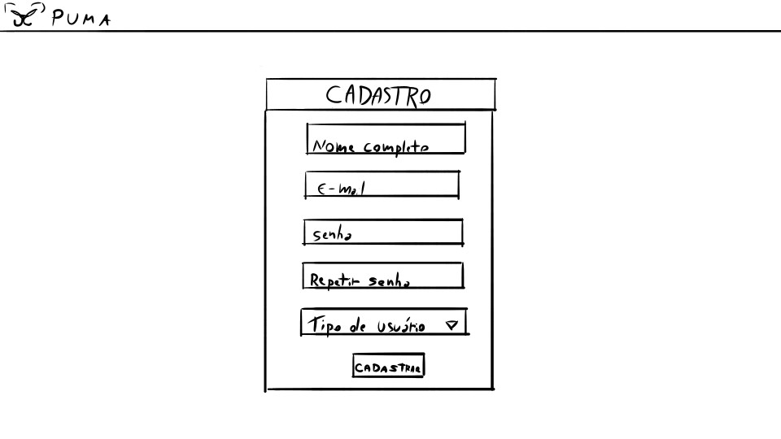
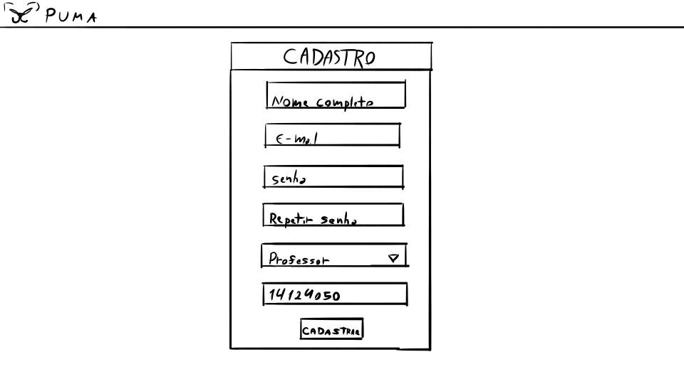
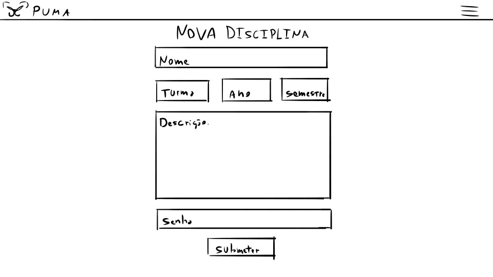
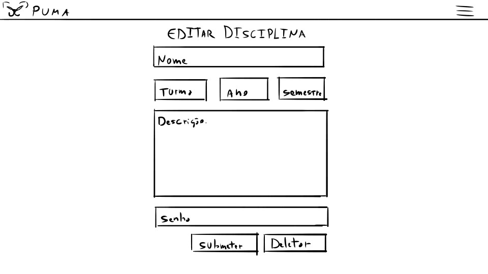
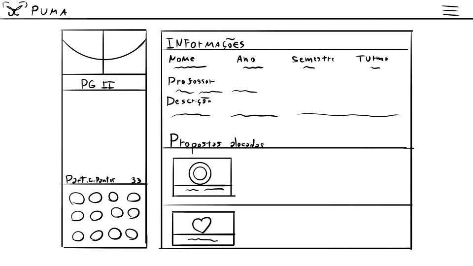
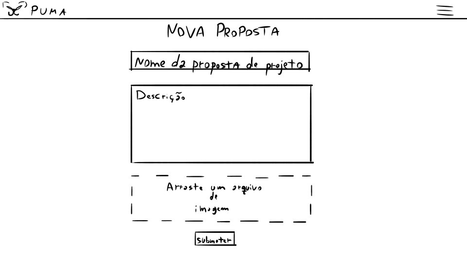

# Protótipo de Baixa Fidelidade
| Data | Versão | Autores | Descrição |
|--|--|--|--|
| 15/09/2021 | 1.0 | Samuel Pereira | Criação do documento |

## Protótipo de Baixa Fidelidade

O protótipo de baixa fidelidade é um protótipo de rápida criação e aprendizagem, possuindo pouca semelhança ao produto final, normalmente se focando em funcionalidade e não em detalhes visuais.

## Protótipo
O protótipo inicial foi desenvolvido buscando abordar as principais telas envolvidas nos requisitos presentes no MVP do PUMA.

### Login

### Recuperação de senha

### Cadastro

### Cadastro de disciplina

### Edição de disciplina

### Página de disciplina

### Registro de proposta

## Validação

Devido a restrições de tempo e circunstâncias organizacionais da equipe, o protótipo de baixa fidelidade foi utilizado principalmente como base para o desenvolvimento da protótipo de alta fidelidade, não havendo uma validação direta desse documento.

## Referências
AQUINO, Wagner. Protótipos de Baixa fidelidade x Alta fidelidade. Qual escolher para seu produto?. Medium. 2020. Disponível em: https://medium.com/pan-design/prot%C3%B3tipos-de-baixa-fidelidade-x-alta-fidelidade-qual-escolher-para-seu-produto-6f3d0f95733c. Acesso em: 15 set. 2021.
VIEIRA, Danielle. Startup Sorocaba: O que são protótipos de baixa e alta fidelidade?. Medium. Disponível em: https://startupsorocaba.com/startup-sorocaba-o-que-sao-prototipos-de-baixa-e-alta-fidelidade/. Acesso em: 15 set. 2021.