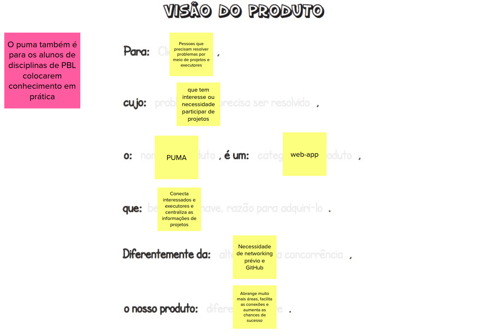
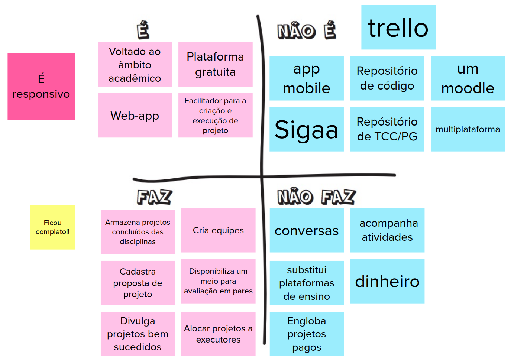
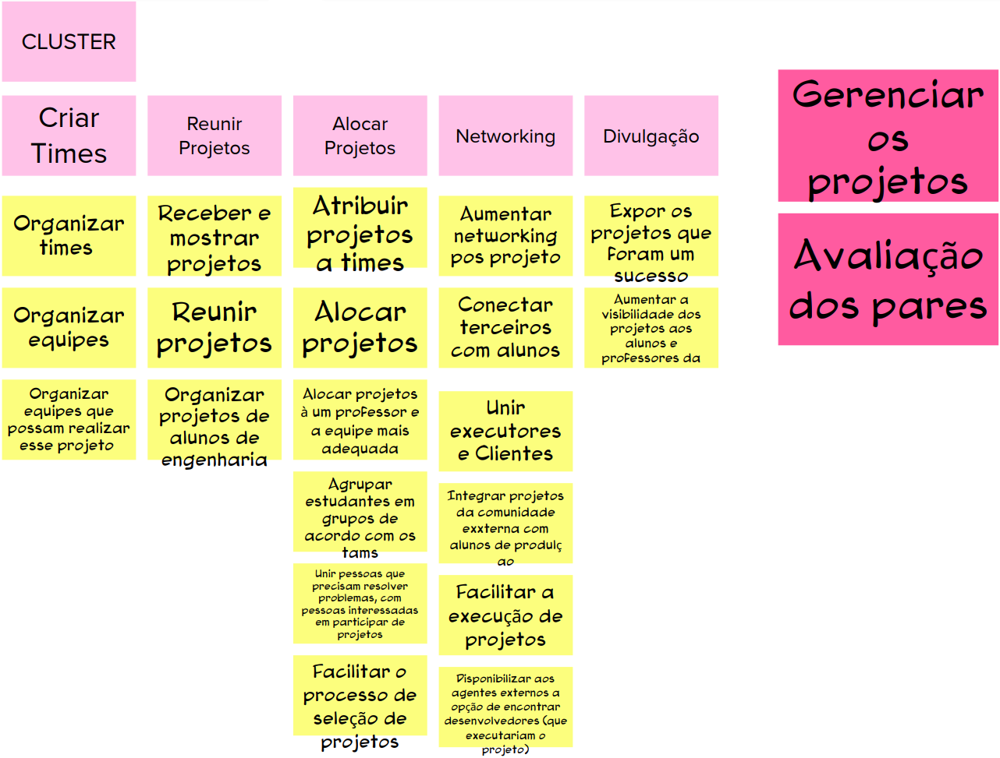
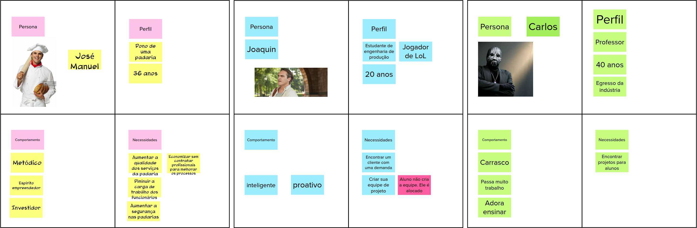
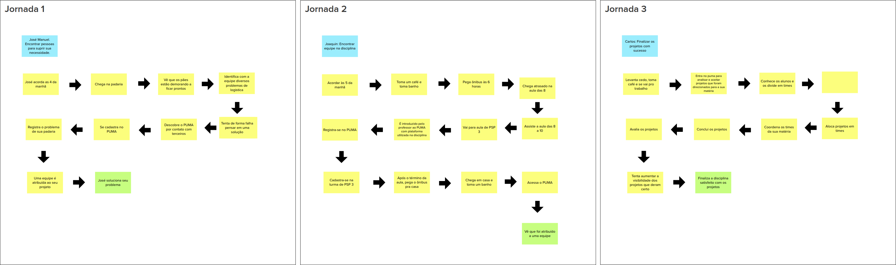
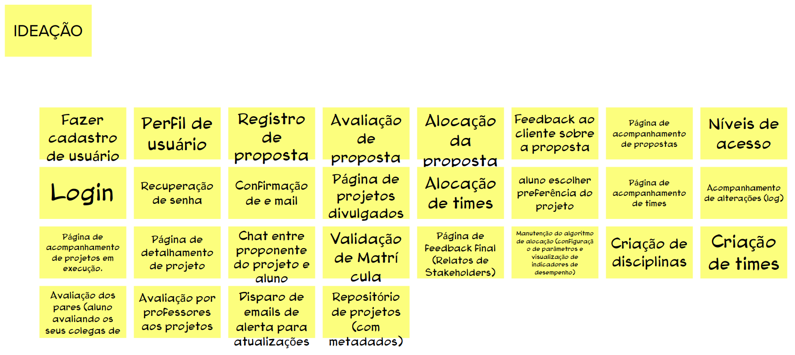
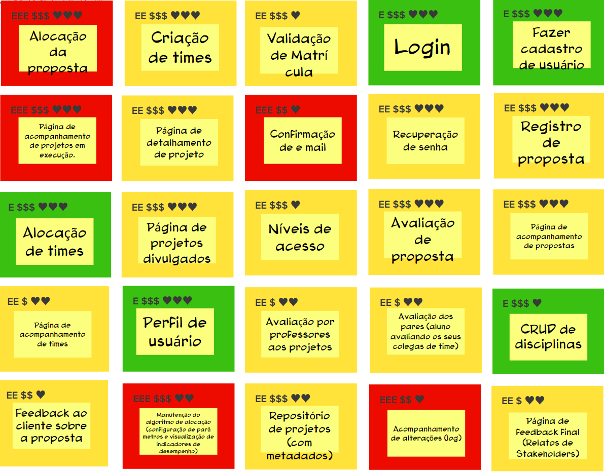
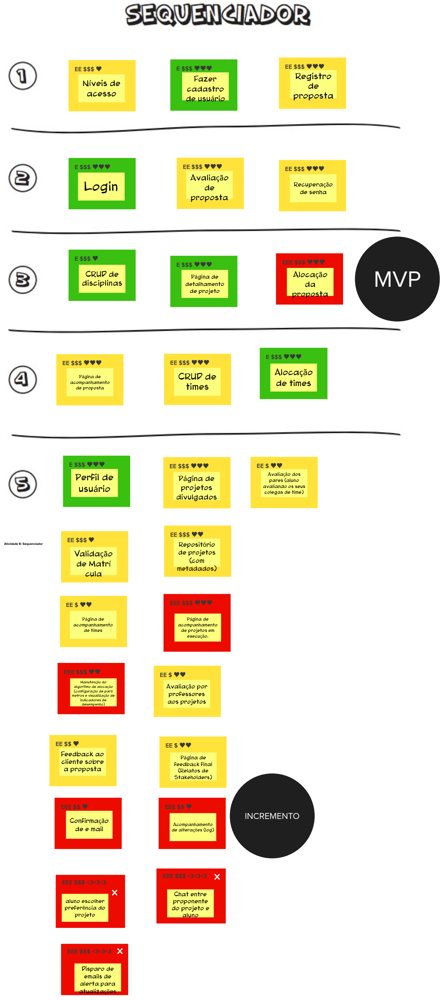

# Visão do Produto
| Data | Versão | Autores | Descrição |
|--|--|--|--|
| 10/09/2021 | 1.0 | Samuel Pereira | Criação do documento |

## Participantes
| Participante | 
|--------------|
| Artur Nunes |
| Eduardo Lima |
| Gabriel Tiveron |
| Giulia Alcantara |
| João Pedro Martins |
| Levi Queiroz |
| Luís Taira |
| Nicolas Mantzos |
| Samuel Pereira |

## Visão do Produto
Esta atividade auxilia a definir a visão do produto de modo colaborativo.  
Os participantes foram separados em três equipes, cada uma responsável por produzir um quadro de visão do produto seguindo o template presente no MURAL da Lean Inception. Ao final, todas as equipes se juntaram para a criação de um único quadro de visão de produto.

### Resultado

## O Produto É - Não é - Faz - Não Faz
Esta atividade busca determinar classificações acerca do produto, ajudando a esclarecer o mesmo. Ao final dessa atividade, os participantes terão uma visão mais alinhada tanto sobre o que o produto faz quanto sobre o que o produto não faz.  
Os participantes foram separados em duas equipes, cada um preenchendo o quadro da atividade seguindo as quatros diretrizes: o produto é; o produto não é; o produto faz; e o produto não faz. Ao final, todas as equipes se juntaram para a criação de um único quadro.

### Resultado

## Objetivos do Produto
Esta atividade auxilia no levantamento e esclarecimento dos objetivos do produto.  
Cada um dos participantes forneceu respostas para a pergunta: "Se você tiver de resumir o produto em três objetivos para o negócio, quais seriam eles?", compartilhando as suas respostas com os demais e as agrupando por similaridade. Ao final, toda a equipe reescreveu e revisou os objetivos compartilhados.

### Resultado

## Personas
Esta atividade auxilia no entendimento a respeito dos usuários do produto, como também acerca de suas necessidades.  
Os participantes foram separados em três equipes, cada uma produzindo uma persona. Ao final, toda os participantes se reuniram e apresentaram as personas criadas.

### Resultado

## Jornada do Usuário
Esta atividade auxilia no entendimento a respeito da interação dos diferentes usuários com o produto.  
Os participantes foram separados em três equipes, cada uma descrevendo a jornada de usuário de uma das personas produzidas anteriormente, onde cada participante deve caracterizar a jornada de uma persona a qual não participou da sua criação.

### Resultado

## Brainstorming de Funcionalidades
Esta atividade é utilizada para o brainstorming de funcionalidades, dependendo da lista de objetivos e personas anteriormente criadas.  
Os participantes participaram de uma atividade de brainstorming com o intuito de descobrir quais funcionalidades são necessárias para atender os objetivos discutidos anteriormente como também as necessidades dos usuários representados pelas personas.

### Resultado

## Revisão Técnica, de Negócio e de UX
Esta atividade busca detalhar, reavaliar e normalizar as diversas funcionalidades levantadas durante o brainstorming de funcionalidades, bem como descartar funcionalidades as quais não fazem sentido levar adiante.  
Os participantes avaliaram cada uma das funcionalidades de acordo com nível de negócio e UX, bem como o nível de confiança técnica acerca de cada uma das funcionalidades, onde a equipe de MDS teve maior impacto na avaliação do último item. Cada funcionalidade recebeu valores em três categorias: esforço, negócio e UX.

### Resultado

## Sequenciador
Esta atividade auxilia na organização e visualizãção das funcionalidades e da sequência de validação incremental do produto.  
Seguindo as regras do sequenciador, os participantes alocaram cards a cada uma das ondas, discutindo e validando o posicionamento definidos. Após a definição do posicionamento dos cards, foi então discutido o que entraria para o MVP e o que se tornaria incrementos.

### Resultado

## Canvas MVP
O Canvas MVP é um quadro visual que auxilia a equipe a alinhar e definir a estratégia do MVP.  
Os participantes foram divididos em duas equipes, produzindo dois canvas MVPs. Após o término desses canvas, todos os participantes se juntaram para a criação de um único canvas.

### Resultado

## Referências
CAROLI, Paulo. **Lean Inception**: How to Align People and Build the Right Product. 1 ed. São Paulo: Caroli, 2018.
