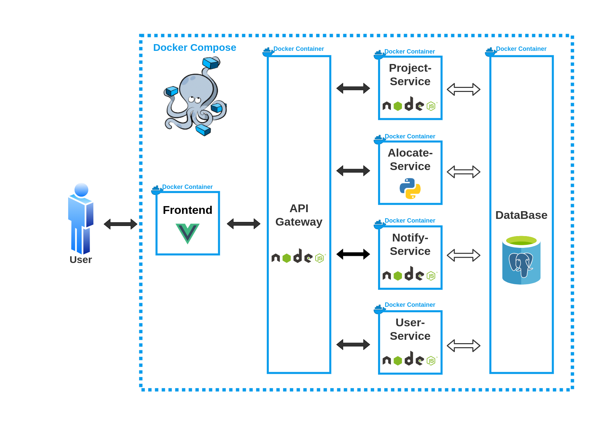
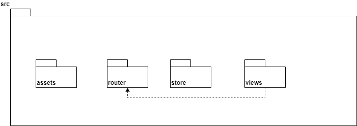
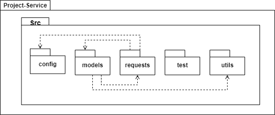
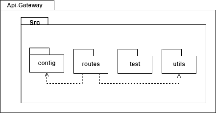
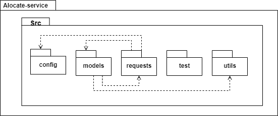

# Histórico de Revisão

| Data | Versão | Modificação | Autor |
| :-- | :-- | :-- | :-- |
| 9/09/2021 | 0.6 | Criação do documento e adição da introdução | João Pedro |
| 13/09/2021 | 0.7 | Adição das tecnologias | Artur |
| 13/09/2021 | 0.8 | Adição dos diagramas de pacotes | Artur e Levi |
| 13/09/2021 | 0.9 | Adição do diagrama de relações, restrições arquiteturais | Luís |
| 13/09/2021 | 1.0 | Adição da representação dos microsserviços | Tiveron |

### 1. Introdução  

    Este documento visa apresentar a arquitetura de software aplicada no desenvolvimento do PUMA, garantindo uma facilidade de visualização dos requisitos e da estrutura para com os desenvolvedores.

#### 1.1 Finalidade  

     Ao esboçar uma visão ampla da arquitetura da plataforma, é possível evidendiar seus aspectos. Sendo assim, esse documento busca transparecer as decisões arquiteturais que foram tomadas em relação ao PUMA.

#### 1.2 Escopo

O PUMA tem como principal objetivo auxiliar a comunidade de Engenharia de Produção, em especial às disciplinas de PSP's, proporcionando a digitalização e uniformização de processos de seleção de times, propostas, projetos e feedbacks aos agentes externos. Este documento aborda os padrões arquiteturais escolhidos para o desenvolvimento do projeto, com o objetivo de fornecer um método ágil e conclusivo para o acompanhamento dos projetos pelos professores, alunos e agentes externos. Será exposto nesse documento toda a lógica de construção do sistema, como também, tecnologias utilizadas, implementação, ambientes de trabalho e frameworks.

#### 1.3 Visão Geral

Estrutura do documento:  

* Introdução;
* Representação da Arquitetura; 
* Metas e Restrições de Arquitetura;
* Visão lógica;

#### 1.4 Definições, Acrônimos e Abreviações

| Sigla       | Significado |
| :---------  | :-----      | 
| HTML	| Hypertext Markup Language (Linguagem de Marcação de Hipertexto) |
| HTTP  | Hypertext Transfer Protocol (Protocolo de Transferência de Hipertexto)|
| SQL   | Structured Query Language (Linguagem de Consulta Estruturada) |
| API   | Application Programming Interface (Interface de Programação de Aplicações)|

#### 1.5 Referências

### 2. Representação da Arquitetura

#### 2.1 Diagrama de Relações

Por ter uma arquitetura de microsserviços, as funções do puma se dividem 7 serviços pensados para rodarem independentemente e se comunicarem por requisições HTTP.
O banco de dados de todo o projeto 

#### 2.1 Representação dos Serviços
##### 2.1.1 Front End

O front end é a interface onde o usuário irá se comunicar com o sistema. É composto por uma tela de cadastro e outra de registro, o que leva à página inicial do PUMA, a página de perfil de usuário. Nesse ponto, há a possibilidade de seguir diversos caminhos dentro do sistema, como as páginas de cadastro de proposta, avaliação de proposta e repositório de projetos.

###### Dependências

- axios 0.21.4
- core-js 3.6.5
- vue 2.6.11
- vue-router 3.2.0
- vuex 3.4.0
- bootstrap 4.5.3
- bootstrap-vue 2.21.2

##### 2.1.2 API Gateway

O API Gateway é utilizado como um mutex para a comunicação entre a interface de usuário e os outros micro-serviços. Dessa forma, ao receber uma requisição o gateway atua como uma ponte entre o front end e o serviço desejado.

##### 2.1.3 Project-Service

O serviço "Project-Service" foi planejado para lidar com todas as tarefas envolvendo projetos do sistema. Assim, o envio de propostas, o encaminhamento para o professor / disciplina adequada e as possíveis alterações nos projetos seriam todas tarefas para o Project-Service resolver.

##### 2.1.4 Alocador

O Alocador é o serviço essencial para o produto, para que seja feita, de forma automática, a relação entre a proposta feita e a disciplina a qual ela deve ser alocada.

##### 2.1.5 Notifier

O Notifier é destinado para quaisquer notificações de alerta para usuários, por e-mail ou por meio da própria plataforma.

##### 2.1.6 User-Service

Desenvolvido para manter o controle de usuários, desde sua criação até o controle das rotas de acesso permitidas, criação de times dentre outros.

#### 2.2 Tecnologias
##### 2.2.1 Vue.js 
É um framework javaScript open-source para criação de aplicações web, ele é muito utilizado para criação de aplicações SPA (Single Page Applications) e também pra vários outros tipos de interface, com foco na interação e experiência do usuário.

##### 2.2.2 Node.js
É uma plataforma de aplicação para Javascript, que tem como principal objetivo facilitar a construção de softwares escaláveis. Ele geralmente é usado ao lado do servidor e é orientado para o estilo de programação voltada a evento. Isso faz com que ele seja leve, eficiente e uma boa alternativa para arquitetura de microsserviços.

##### 2.2.3 Python
Python é uma linguagem open-source de propósito geral usado bastante em desenvolvimento web e em areás mais complexas como data Science e machine learning .
##### 2.2.4 PostgreSQL 
O PostgreSQL é um gerenciador de banco de dados relacionais que proporciona forte confiabilidade, robustez de recursos e desempenho.

##### 2.2.5 Docker
Docker é uma plataforma, open-source para criação, execução e deploy de contêineres. Esses contêineres são pacotes da aplicação contendo suas dependências, bibliotecas e arquivos de configuração.

##### 2.2.6 Docker Compose
Docker Compose é um orquestrador de contêineres Docker. Com ele é possível gerenciar vários contêineres de uma única vez, definindo o comportamento de cada um deles.

### 3. Restrições de Arquitetura
* JavaScript: Linguagem em que são programados todos os microsserviços.
* Vue.js: Framework em que o frontend é desenvolvido
* Node.js: Ambiente runtime em que os microsserviços api gateway, project-service, notify service e user service são desenvolvidos.
* Python: Linguagem na qual será desenvolvido o microsserviço alocate-service.
* 

### 4. Visão Lógica

#### 4.1 Diagrama de Pacotes

Diagrama de pacotes Front End

Diagrama de pacotes Project Service

Diagrama de pacotes API Gateway

Diagrama de pacotes Alocate Service

Diagrama de pacotes Notify Service

Diagrama de pacotes User Service