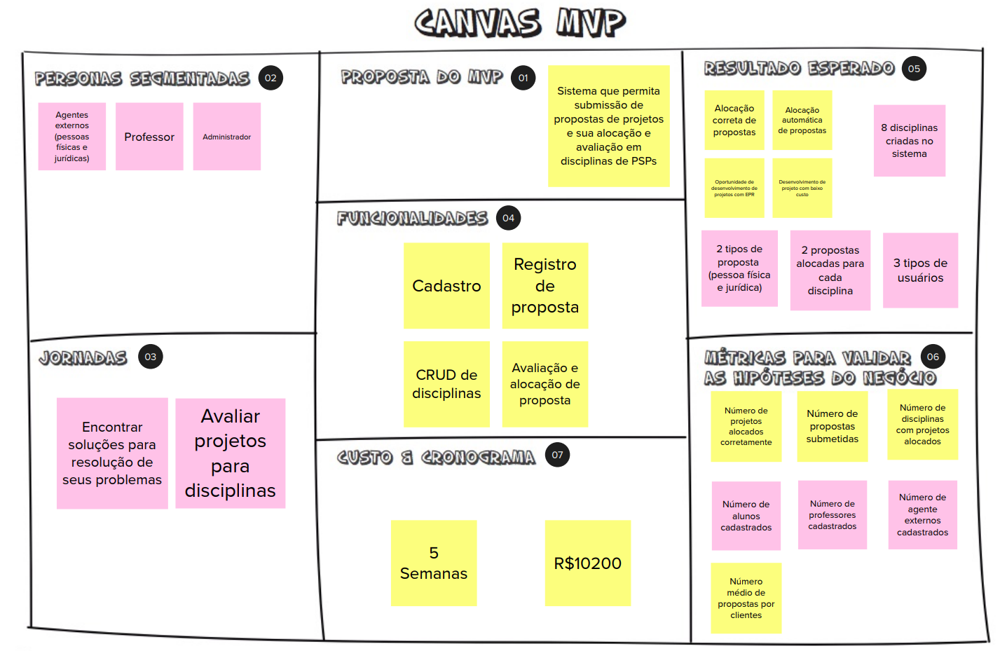

| Data | Versão | Autores | Descrição |
|--|--|--|--|
| 07/11/2021 | 1.0 | Luís Taira | Criação do documento |

# Histórias de usuário

| Entregue | Breve Descrição | Número |
|--|--|--|
| Sim | Cadastro | 01 |
| Sim | Login | 02 |
| Sim | Cadastro de proposta | 03 |
| Sim | Avaliação de proposta | 04 |
| Não | Redefinição de senha | 05 |
| Não | CRUD de disciplinas | 06 |
| Sim | Detalhamento de projeto | 07 |
| Não | Alocação de proposta | 08 |
| Sim | Acompanhamento de propostas | 09 |
| Não | Crud de times | 10 |
| Não | Alocação de times | 11 |
| Não | Perfil de usuário | 12 |
| Não | Projetos divulgados | 13 |
| Não | Avaliação por pares | 14 |
| Não | Validação de matrícula | 15 |
| Não | Repositório de projetos | 16 |
| Não | Acompanhamento de times | 17 |
| Não | Acompanhamento de projetos | 18 |
| Não | Manutenção do algorítmo | 19 |
| Não | Avaliação por professores | 20 |
| Não | Feedback ao cliente  | 21 |
| Não | Feedback dos stakeholders | 22 |
| Não | Confirmação do e-mail | 23 |
| Não | Acompanhamento de alterações | 24 |

### MVP: 62,5% entregue
| Entregue | Breve Descrição | Número |
|--|--|--|
| Sim | Cadastro | 01 |
| Sim | Login | 02 |
| Sim | Cadastro de proposta | 03 |
| Sim | Avaliação de proposta | 04 |
| Não | Redefinição de senha | 05 |
| Não | CRUD de disciplinas | 06 |
| Sim | Detalhamento de projeto | 07 |
| Não | Alocação de proposta | 08 |

### Escopo combinado para a RN: 83,3% entregue
| Entregue | Breve Descrição | Número |
|--|--|--|
| Sim | Cadastro | 01 |
| Sim | Login | 02 |
| Sim | Cadastro de proposta | 03 |
| Sim | Avaliação de proposta | 04 |
| Não | CRUD de disciplinas | 06 |
| Sim | Detalhamento de projeto | 07 |

* Jornadas de usuários cumpridas
* O custo foi reavaliado em [EVM](/rn/evm)
* Funcionalidaeds cimpridas, menos o CRUD de disciplinas
* A métricas para avaliar o sucesso acabaram não fazendo sentido

### Extra
| Entregue | Breve Descrição | Número |
|--|--|--|
| Sim | Acompanhamento de propostas | 09 |

### Critérios de aceitação
* Testes de integração, unitários e de qualidade de código

Não houve código desenvolvido nos repositórios Notify Service e Alocate Service.

* Testes em nível de sistema pelos usuários
Validações realizadas semanalmente, além de roteiro de testes realizado pelo Guilherme

