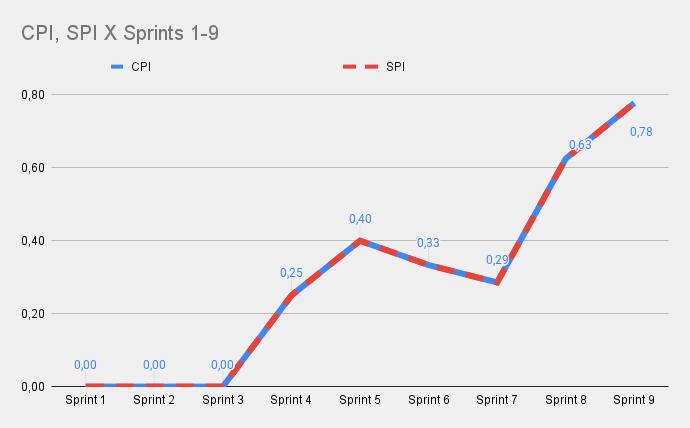

| Data | Versão | Autores | Descrição |
|--|--|--|--|
| 07/11/2021 | 1.0 | Luís Taira | Criação do documento |

# Sprint 0

&nbsp&nbsp&nbsp&nbsp&nbsp&nbsp Chamamos de sprint 0 as semanas que foram dedicadas à realização das metodologias Lean Inception e Product Backlog Building.

&nbsp&nbsp&nbsp&nbsp&nbsp&nbsp Para calcular o custo da sprint 0 utilizamos o EVM tradicional, pegando o somatório de esforço total nescessário e analisando o período no qual esse esforço é dividido.

&nbsp&nbsp&nbsp&nbsp&nbsp&nbsp Durante a Sprint 0, o esforço se apresenta na forma de reuniões que precisavam ser realizadas para a execução da LI e PBB. O orçamento total alocado para este período então é o somatório do custo de cada uma das reuniões, que é calculado a partir da duração da cada reunião, em horas, multiplicada pelo número de participantes, multiplicado pelo custo por hora de cada participante.

&nbsp&nbsp&nbsp&nbsp&nbsp&nbsp É utilizado o EVM tradicional para analisar a execução da sprint 0.

&nbsp&nbsp&nbsp&nbsp&nbsp&nbsp A partir desses gráficos é possível perceber que o desenvolvimento da sprint 0 ocorreu como esperado. Com as reuniões e rituais sendo realizados, sem deixar pendências.

# Sprints 1 a 9

&nbsp&nbsp&nbsp&nbsp&nbsp&nbsp O custo do projeto na etapa de desenvolvmento, durante as sprints de 1 a 9, é calculado usando o Agile EVM, no qual a quantidade de esforço é medida sprint a sprint de acordo com os pontos de história de cada sprint.

&nbsp&nbsp&nbsp&nbsp&nbsp&nbsp O orçamento total alocado foi calculado a partir de uma estimativa de que cada membro dedicaria 12 horas por semana ao projeto

&nbsp&nbsp&nbsp&nbsp&nbsp&nbsp A partir desse orçamento, é usado o Agile EVM para analisar o custo dessa etapa do projeto.

&nbsp&nbsp&nbsp&nbsp&nbsp&nbsp A partir desses gráficos, é possível tirar várias conclusões.

&nbsp&nbsp&nbsp&nbsp&nbsp&nbsp Até a sprinit 3, não havia sido agregado nenhum valor real ao produto, até que na sprint 4 foi mantido um rítmo até a sprint 5, quando o valor se estagnou até a sprint 8, na qual muito valor foi muito agregado. Importante lembrar que o evm não mede a quantidade de trabalho realizado pelo time. Isso pode ser conferido no velocity.

&nbsp&nbsp&nbsp&nbsp&nbsp&nbsp O comportamento desses gráficos pode ser explicado por vários fenômenos ocorridos durante o projeto.

&nbsp&nbsp&nbsp&nbsp&nbsp&nbsp Até a sprint 3, o desenvolvimento das histórias de usuário estavam sob a responsabilidade do time de MDS. Valor começou a ser agregado quando EPS começou a desenvolver também.

&nbsp&nbsp&nbsp&nbsp&nbsp&nbsp É possível perceber uma queda no valor agregado na sprint 5, seguido por uma grande alta na sprint 8. Isso pode ser explicado por várias histórias estarem sendo desenvolvidas ao mesmo tempo e aconteceu que grandes entregas foram feitas nas sprints 4 e 5, tendo a sprint 5 e 7 poucas entregas e histórias que acumularam e foram de novo entregues juntas na sprint 8.

