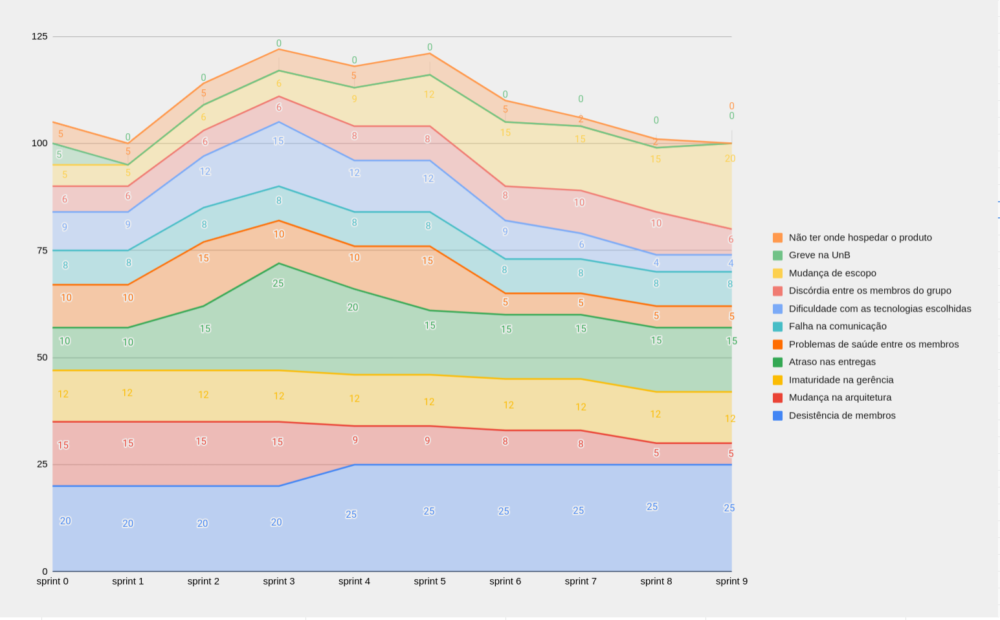

| Data | Versão | Autores | Descrição |
|--|--|--|--|
| 06/11/2021 | 0.9 | Luís Taira | Adição do gráfico burndown de riscos |
| 07/11/2021 | 1.0 | Luís Taira | Adição da análise |

# Burndown de Riscos

# Análise de cada risco

### Não ter onde hospedar o produto

&nbsp&nbsp&nbsp&nbsp&nbsp&nbspNo começo do projeto, não havia certeza de onde o produto ficaria hospedado e nem se seria possível essa hospedagem depois que acabasse o semestre. O impacto desse risco diminuiu quando foi consolidado o ambiente de homologação no google cloud e mais ainda no final, quando foi verificado que a hospedagem na gigacandanga iria funcionar sem problemas.

### Greve na Unb

&nbsp&nbsp&nbsp&nbsp&nbsp&nbspFoi considerado um risco no começo do semestre, especialmente por causa da situação de pandemia, mas logo ficou claro que o projeto não seria afetado por isso.

### Mudança de escopo

&nbsp&nbsp&nbsp&nbsp&nbsp&nbspUm risco que esteve presente desde o começo do projeto. Seu impacto aumentou quando foi verificado que o time realmente não conseguiria entregar o escopo definido na sprint 0, pois era realmente muito grande e mais ainda porque ficou claro que alguns membros do time não estavam se dedicando o tanto nescessário para entregar tal escopo.
Nas sprints finais, o impacto desse risco aumentou mais ainda pois o time ficou com dificuldades para entregar o que foi acordado após a mudança de escopo.

### Discórdia entre membros do grupo

&nbsp&nbsp&nbsp&nbsp&nbsp&nbspNo começo do projeto foi identificado que isso poderia afetar o projeto. Seu impacto aumentou quando ficou claro que o time de MDS não iria conesguir cumprir suas tarefas e aumentou mais ainda no final, quando ocorreram problemas de comunicação dentro do time de MDS que resultaram em um membro apagando código feito por outro membro e assim, retrabalho.

### Dificuldade com as tecnologias escolhidas

&nbsp&nbsp&nbsp&nbsp&nbsp&nbspÉ sempre normal que os projetos começem devagar enquanto os membros estão aprendendo as tecnologias. O impacto deste risco aumentou quando ficou claro que o time de MDS não estava conseguindo desenvolver de acordo com o esperado e a dificuldade com as tecnologias se mostrou uma das razões para isso.

&nbsp&nbsp&nbsp&nbsp&nbsp&nbspO impacto deste risco diminuiu a medida que o time ficou mais e mais familiar com as tecnologias e os EPSs começaram a desenvolver também.

### Falha na comunicação

&nbsp&nbsp&nbsp&nbsp&nbsp&nbspEsse risco esteve presente ao longo de todo o projeto.

&nbsp&nbsp&nbsp&nbsp&nbsp&nbspFalhas na comunicação podem ocorrer em quaisquer projetos. Mas no caso do PUMA, seu impacto não foi diminuído porque ao longo de todo o projeto certos membros não foram participativos em reuniões e as falhas ocorreram justamente envolvendo eles.

### Problemas de saúde entre membros

&nbsp&nbsp&nbsp&nbsp&nbsp&nbspEsse risco foi identificado no começo, quando membros tiveram que se ausentar das atividades de Lean Inception e PBB por riscos de saúde. É possível identificar que o impacto desse risco foi maior nos momentos em que o João pegou covid e depois síndrome pós covid e o Artur ficou doente, ambos precisando de tempo para se recuperar.

### Atraso nas entregas

&nbsp&nbsp&nbsp&nbsp&nbsp&nbspRisco que pode estar presente em qualquer projeto. No puma, seu impacto foi maior nas primeiras sprints, quando quando foi percebido que várias semanas tinham se passado e o time de MDS não havia entregado nenhuma tarefa.

&nbsp&nbsp&nbsp&nbsp&nbsp&nbspSeu impacto diminuiu quando o time de EPS se envolveu no desenvolvimento e o escopo foi mudado para acomodar o rítmo de desenvolvimento do time, porém permaneceu existente pois o risco de atrasar as entregas ainda eram presentes e seu impacto permaneceu grande porque o tempo que tínhamos para entregar as histórias era menor ainda.

### Imaturidade na gerência

&nbsp&nbsp&nbsp&nbsp&nbsp&nbspPermaneceu constante ao longo do projeto pois o time de EPS ainda é pouco experiente com gerência de projetos e problemas ocorridos ao longo do projeto podem ser atríbuidos a essa inexperiência

### Mudança na arquitetura

&nbsp&nbsp&nbsp&nbsp&nbsp&nbspEsse risco estava presente desde o começo do projeto, tanto que houve mudança de arquitetura. Mas seu impacto diminuiu ao longo do tempo, a medida que a arquitetura foi adequada às expectaticas das disciplinas e foi ficando claro que era ideal para o projeto.

### Desistência de membros

&nbsp&nbsp&nbsp&nbsp&nbsp&nbspFoi identificado no começo do projeto pois os membros estavam desanimados e alguns já ameaçavam desistir. Seu impacto foi realmente significativo no projeto, que perdeu dois membros, Giulia e Samuel. O impacto cresceu ao máximo quando o Samuel saiu do time, pois fez grande diferença.

&nbsp&nbsp&nbsp&nbsp&nbsp&nbspAo longo de todo o projeto, outros membros além de Giulia e Samuel também apresentaram risco de sair, e produziram quase nada ao longo do semestre.

