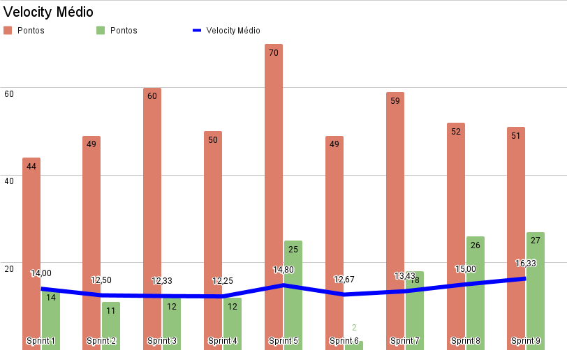

| Data | Versão | Autores | Descrição |
|--|--|--|--|
| 07/11/2021 | 1.0 | Luís Taira | Criação do documento |

# Velocity médio

&nbsp&nbsp&nbsp&nbsp&nbsp&nbsp O velocity mede a quantidade de trabalho que a equipe consegue realizar em uma sprint. O velocity médio é a média do velocity do conjunto de todas as sprints.

&nbsp&nbsp&nbsp&nbsp&nbsp&nbsp Para a medição do velocity são usadas as pontuações de todas as tarefas realizadas pelo time. Não só os pontos de história de usuário. Assim é possível medir o esforço do time, e não só o valor de produto agregado.

### Análise

&nbsp&nbsp&nbsp&nbsp&nbsp&nbsp Uma característica marcante desse velocity é que, durante todo o projeto, foram levantados mutos mais pontos por sprint do que o time foi capaz de conclir. Parte disso pode ser explicado pelas histórias de usuário que foram alocadas para o time de MDS nas sprints 1, 2 e 3 que não foram completas, deixando uma grande quantidade de pontos para as próximas sprints. O time de EPS então teve que assumir essas tarefas e como resultado deixando algumas de suas tarefas de lado. Algumas dessas que não puderam ser concluídas até o final do projeto.

&nbsp&nbsp&nbsp&nbsp&nbsp&nbsp Uma coisa muito importante que esse gráfico de velocity mostra é a estabilidade do rítmo de trabalho da equipe como um todo.

&nbsp&nbsp&nbsp&nbsp&nbsp&nbsp O EVM mostra qunto valor foi agregado ao produto ao longo do tempo e por ele é possível perceber que nenhum valor foi agregado até a sprint 4. Porém, pelo velocity, vemos que a equipe tem tido o mesmo rítmo de trabalho desde o começo do projeto, mesmo que parte desse trabalho não se reflita em histórias de usuário sendo entregues.

&nbsp&nbsp&nbsp&nbsp&nbsp&nbsp 

&nbsp&nbsp&nbsp&nbsp&nbsp&nbsp 

