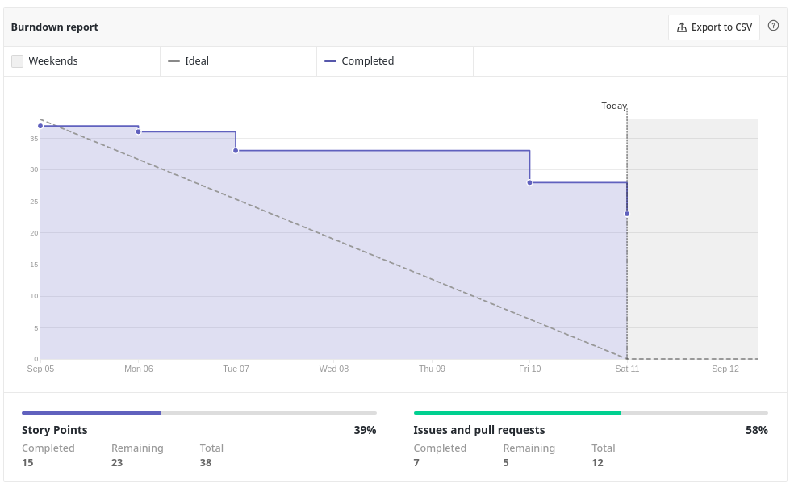

| Data | Versão | Autores | Descrição |
|--|--|--|--|
| 11/09/2021 | 1.0 | Luís Taira | Criação do documento |
| 21/09/2021 | 1.0 | Luís Taira | Adição do quadro de conhecimento |

# Resultados da Sprint 1
Reunião realizada em 10/9/2021

### Membros presentes
| Membro | Presente | Observação |
|--|--|--|
|Artur Vinicius Dias Nunes| Sim |  |
|EduarSaiu antes do fim da reuniãoiel Marques Tiveron| Sim |  |
|Giulia Domingues de Alcantara| Sim |  |
|João Pedro de Aquino Corrêa Martins| Não | Estava passando mal |
|Levi de Oliveira Queiroz| Não |  |
|Luís Henrique Pereira Taira| Sim |  |
|Nicolas Georgeos Mantzos| Sim |  |
|Samuel de Souza Buters Pereira| Sim |  |

## Issues da sprint 

| Issue | Entregue |
| -- | -- |
| Modelar bando de dados  | Sim |
| Criar templates de issue | Sim |
| Planejamento/Comunicação interna e externa | Sim |
| Visão de produto e canvas MVP | Sim |
| Criar ambiente de desenvolvimento | Sim |
| Criar template de pull request | Sim |
| Product Backlog Building | Sim |
| Definir arquitetura do projeto | Não |
| Pipeline CI - SonarCloud | Não |
| US01 - Eu como usuário posso fazer cadastro para ter acesso ao PUMA | Não |
| US02 - Eu usuário posso fazer login para acessar o PUMA | Não |
| US03 - Eu como agente externo posso registrar proposta de projeto para resolver um problema | Não |

## Visão do time sobre a sprint
### Pontos Positivos
* Bom ter terminado backlog e lean inception e começar as sprints.
* Treinamentos deram resultado.

### Pontos negativos
* Demoramos muito para terminar a Lean inception, o que atrasou o começo das sprints
* Falta de organização da arquitetura. Que terá que ser refeita
* Dificuldade de identificar as issues de EPS porque foi difícil encontrar o que tinhamos que entregar e quem tinha que fazer.

### Pontos a Melhorar
* Dificuldade em realizar pareamento
* Organização em planejar as issues de EPS, que foram surgindo no meio da sprint.
* MDS não conseguiu entregar nenhuma issue.
* Faltas em daily sem justificativa.

## Burndown

## Avaliação de Scrum Master

O time de EPS estava muito desorganizado na sprint 1, o que causou o atraso de algumas entregas e a falta de noção do que tinhamos que entregar. Por isso também, várias issues foram levantadas e adicionadas à sprint no meio dela, enquanto deveriam ter sido adicionadas durante o planejamento.

A falta de maturidade e de organização de EPS foi uma das causas de o time de MDS não ter entregado nenhuma issue. Outra causa é a falta de unidade do time de MDS, o que pode ser explicado por eles não se conhecerem antes da matéria.

O time de EPS precisa organizar suas entregas e conseguir gerênciar melhor o time, acompanhando mais de perto o andamento das issues de MDS e promovendo a boa comunicação entre todos.

O time de MDS precisa se dedicar para aprender as tecnologias e não deixar mais dívida técnica, que só complica mais as sprints sequintes, e se organizar para não faltar mais em dailies e reuniões.

## Quadro de conhecimento depois da sprint 1

