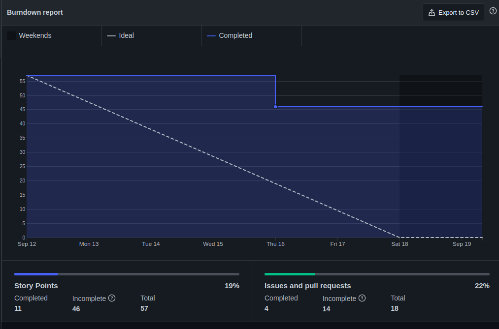

| Data | Versão | Autores | Descrição |
|--|--|--|--|
| 21/09/2021 | 1.0 | Luís Taira | Criação do documento |

# Resultados da Sprint 2
Reunião realizada em 17/9/2021

### Membros presentes
| Membro | Presente | Observação |
|--|--|--|
|Artur Vinicius Dias Nunes| Sim | Saiu antes da metade da reunião. |
|Tiveron| Sim |  |
|Eduardo| Sim |  |
|Giulia Domingues de Alcantara| Não |  |
|João Pedro de Aquino Corrêa Martins| Sim |  |
|Levi de Oliveira Queiroz| Sim | Saiu antes da metade da reunião. |
|Luís Henrique Pereira Taira| Sim |  |
|Nicolas Georgeos Mantzos| Sim |  |
|Samuel de Souza Buters Pereira| Sim |  |

## Issues da sprint 

| Issue | Entregue |
| -- | -- |
| Documento de identidade visual  | Sim |
| Definir arquitetura do projeto  | Sim |
| Criar guia de contribuição | Sim |
| Planejar healthcheck | Sim |
| Documento de arquitetura | Sim |
| Plano de gerenciamento de riscos | Sim |
| Documentar resultados da sprint 1| Sim |
| Documentar planejamento da sprint 2 | Sim |
| Protótipo de baixa e alta fidelidade | Sim |
| Definir licença | Não |
| Roadmap de deploy | Não |
| US04 - Eu como professor posso visualizar uma proposta para avaliá-la  | Não |
| US05 - Eu como usuário posso redefinir minha senha para continuar tendo acesso à minha conta  | Não |

## Visão do time sobre a sprint
### Pontos Positivos

### Pontos negativos
* Nenhuma história de usuário entregue até agora

### Pontos a Melhorar
* MDS tem que ter melhor comunicação e parear mais

## Burndown

## Avaliação de Scrum Master

A organização do time de EPS melhorou mas ainda foram deixadas dívidas técnicas.

O time de MDS não está trabalhando como um time e não estão organizados e como um todo não estão trabalhando o suficiente nem se dedicando a participar das atividades de sprint, o que causou o fato de nenhuma história de usuário ter sido entregue por duas sprints seguidas.

É muito preocupante o fato de Giulia não ter participado do desenvolvimento de código em nenhum momento e não ter pareado com ninguém.

## Quadro de conhecimento depois da sprint 2

