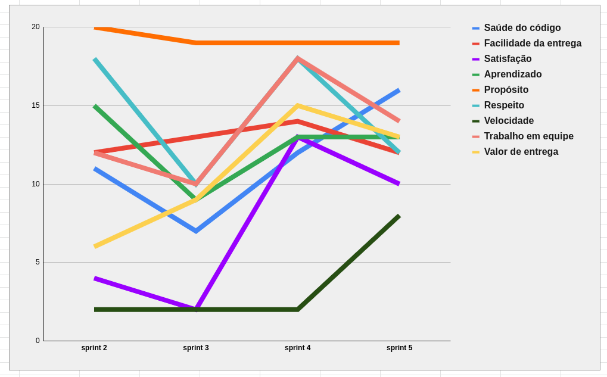

| Data | Versão | Autores | Descrição |
|--|--|--|--|
| 08/10/2021 | 1.0 | Luís Taira | Criação do documento |

# Resultados da Sprint 3
Reunião realizada em 24/9/2021

### Membros presentes
| Membro | Presente | Observação |
|--|--|--|
|Artur Vinicius Dias Nunes| Sim |  |
|Tiveron| Sim |  |
|Eduardo| Sim |  |
|Giulia Domingues de Alcantara| Sim |  |
|João Pedro de Aquino Corrêa Martins| Não |  |
|Levi de Oliveira Queiroz| Sim |  |
|Luís Henrique Pereira Taira| Sim |  |
|Nicolas Georgeos Mantzos| Sim |  |
|Samuel de Souza Buters Pereira| Sim |  |

## Issues da sprint 

| Issue | Entregue |
| -- | -- |
| Extrair métricas pelo pipeline  | Não |
| Criar pipelines de cada repositório | Não |
| Replanejar arquitetura das pastas | Não |
| Remodelar o banco de dados | Não |
| Atualizar visual da wiki | Não |
| Codar API Gateway| Sim |
| Mover o código de repositórios | Sim |
| Adicionar planejamento da sprint 3 e review da sprint 2 | Sim |

## Visão do time sobre a sprint
### Pontos Positivos

### Pontos Positivos
* EPS melhorou a própria organização

### Pontos negativo
* Mais uma sprint sem entrega de nenhuma história de usuário
* Pouca intereção entre MDS

### Pontos a Melhorar
* Organização de MDS
* Trabalho em equipe de MDS

## Healthcheck

## Burndown

## Quadro de conhecimento depois da sprint 3

