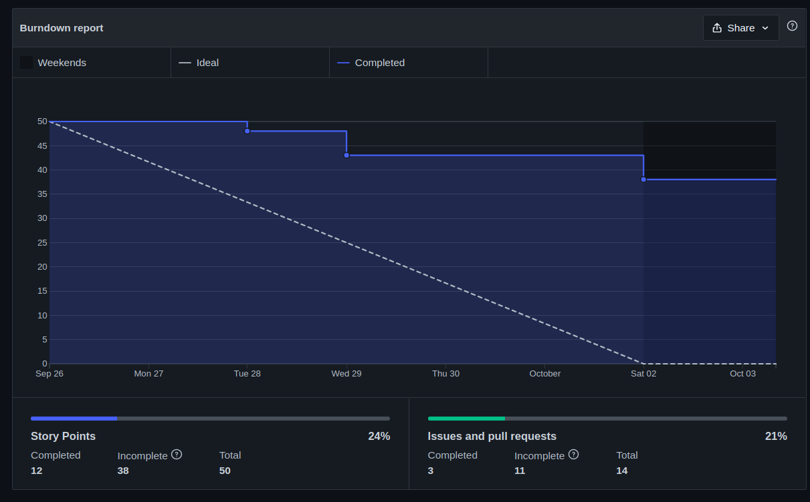

| Data | Versão | Autores | Descrição |
|--|--|--|--|
| 08/10/2021 | 1.0 | Luís Taira | Criação do documento |

# Resultados da Sprint 4
Reunião realizada em 01/10/2021

### Membros presentes
| Membro | Presente | Observação |
|--|--|--|
|Artur Vinicius Dias Nunes| Sim |  |
|Tiveron| Sim |  |
|Eduardo| Sim | Saiu na metade porque tinha uma consulta médica |
|Giulia Domingues de Alcantara| Não | Precisou levar o cachorro na emergência |
|João Pedro de Aquino Corrêa Martins| Sim |  |
|Levi de Oliveira Queiroz| Sim | Saiu na metade da reunião |
|Luís Henrique Pereira Taira| Sim |  |
|Nicolas Georgeos Mantzos| Sim |  |
|Samuel de Souza Buters Pereira| Sim |  |

## Issues da sprint 

| Issue | Entregue |
| -- | -- |
| Colocar na wiki planejamento da Sprint 4 e review da Sprint 3  | Não |
| Plotar e colocar Health Checks | Não |
| Atualizar diagrama de pacotes | Não |
| Refatorando documento de arquitetura | Sim |

## Visão do time sobre a sprint
### Pontos Positivos
* Terminou nossa primeira história de usuário
* MDS está pareando
* Maior participação do time de MDS
* US que não foi entregue ainda está avançando

### Pontos negativo
* Muito problema com docker

### Pontos a Melhorar
* Disponibilidade para parear
* Velocidade de codar
* Priorizar melhor as tarefas

## Healthcheck

## Burndown

## Quadro de conhecimento depois da sprint 4

