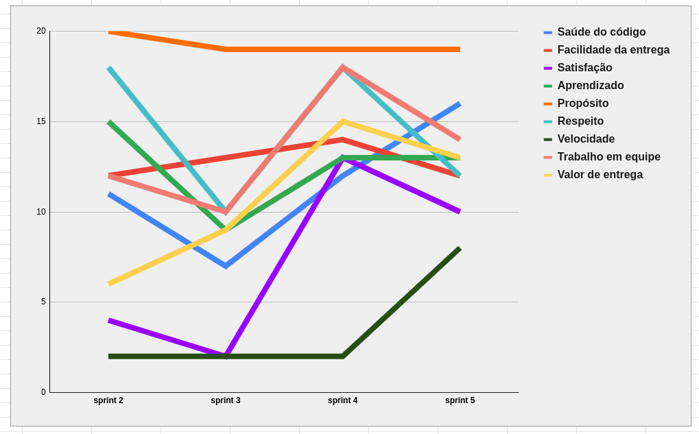

| Data | Versão | Autores | Descrição |
|--|--|--|--|
| 08/10/2021 | 1.0 | Luís Taira | Criação do documento |

# Resultados da Sprint 5
Reunião realizada em 08/10/2021

### Membros presentes
| Membro | Presente | Observação |
|--|--|--|
|Artur Vinicius Dias Nunes| Sim |  |
|Tiveron| Sim |  |
|Eduardo| Sim |  |
|João Pedro de Aquino Corrêa Martins| Sim |  |
|Levi de Oliveira Queiroz| Sim | Saiu antes da planning da sprint 6 |
|Luís Henrique Pereira Taira| Sim |  |
|Nicolas Georgeos Mantzos| Sim | Não estava na review da sprint 5 |

## Issues da sprint 

| Issue | Entregue |
| -- | -- |

## Visão do time sobre a sprint
### Pontos Positivos
* Pareamentos acontecendo
* Bastantes issue fechadas
* Shitoberfest
* Dosamos um pouco melhor o tanto de pontos que pegamos
* Parebéns pro Samuel

### Pontos negativo
* Equipe fica cada vez menor
* Falta de comunicação entre membros
* Falta de foco
* Shitoberfest
* Outras matérias ocuparam muito o nosso tema

### Pontos a Melhorar
* Comunicação do grupo
* Participação dos membros

## Healthcheck

## Burndown

## Quadro de conhecimento depois da sprint 4

